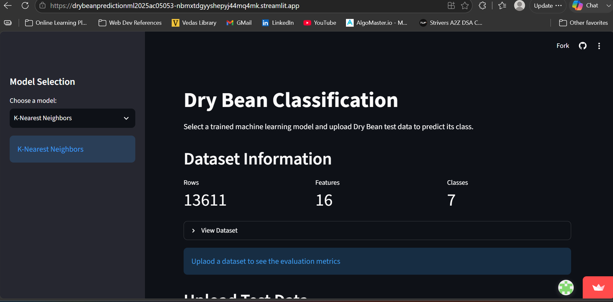
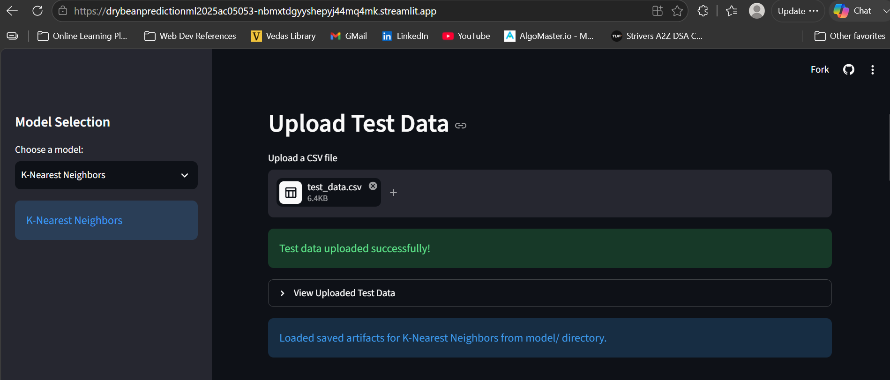
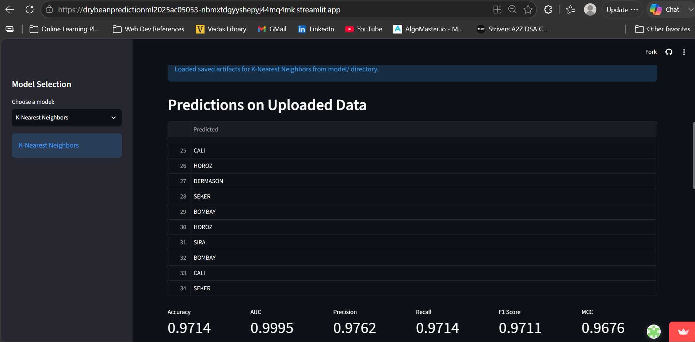
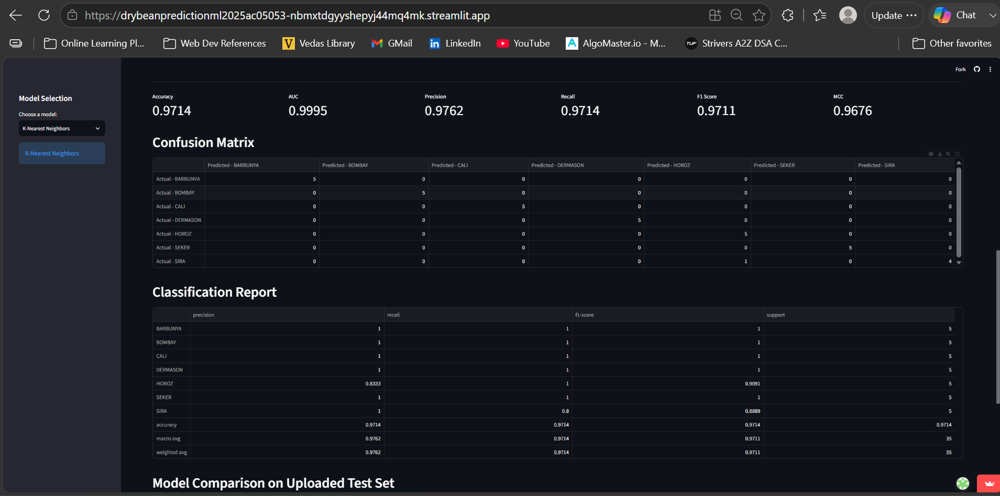
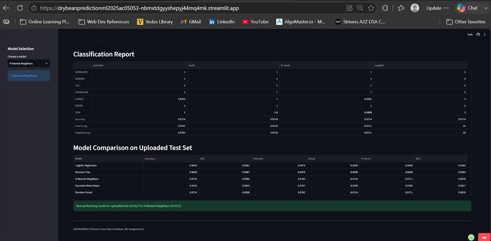

# Dry Bean Classification — DryBeanPrediction_ML_2025ac05053

**Problem statement:** Predict the class of a dry bean sample from its measured morphological features. The goal is to compare several classic machine-learning classifiers on the same dataset and report evaluation metrics so the best performing model can be identified and used for prediction.

**Dataset description:**
- **Name:** Dry Bean Dataset (CSV expected as `Dry_Bean_Dataset.csv` in the project root).
- **Samples:** 13,611 rows (observations) in the full dataset.
- **Target column:** `Class` (categorical label identifying bean type). There are 7 classes: `BARBUNYA`, `BOMBAY`, `CALI`, `DERMASON`, `HOROZ`, `SEKER`, `SIRA`.
- **Class distribution (counts):**
	- DERMASON: 3,546
	- SIRA: 2,636
	- SEKER: 2,027
	- HOROZ: 1,928
	- CALI: 1,630
	- BARBUNYA: 1,322
	- BOMBAY: 522
- **Features (16 numeric columns):**
	- `Area`: Pixel area of the bean shape.
	- `Perimeter`: Perimeter length of the bean contour.
	- `MajorAxisLength`: Length of the major axis of the fitted ellipse.
	- `MinorAxisLength`: Length of the minor axis of the fitted ellipse.
	- `AspectRation`: Ratio of major to minor axis (shape elongation).
	- `Eccentricity`: Eccentricity of the fitted ellipse (shape property).
	- `ConvexArea`: Area of the convex hull of the bean shape.
	- `EquivDiameter`: Diameter of a circle with the same area as the bean.
	- `Extent`: Ratio of object area to bounding box area.
	- `Solidity`: Ratio of area to convex area (measure of concavity).
	- `roundness`: Measure of roundness (derived feature).
	- `Compactness`: Measure of compactness (derived feature).
	- `ShapeFactor1`, `ShapeFactor2`, `ShapeFactor3`, `ShapeFactor4`: Additional shape descriptors used in the original dataset.

**GitHub repository:** https://github.com/C03vaibhav/DryBeanPrediction_ML_2025ac05053

**Models used:** The project contains scripts and training code for the following models (files under the `model/` folder):
- Logistic Regression — [model/logistic_regression.py](model/logistic_regression.py#L1-L200)
- Decision Tree — [model/decision_tree.py](model/decision_tree.py#L1-L200)
- K-Nearest Neighbors — [model/knn.py](model/knn.py#L1-L200)
- Gaussian Naive Bayes — [model/naive_bayes.py](model/naive_bayes.py#L1-L200)
- Random Forest (Ensemble) — [model/random_forest.py](model/random_forest.py#L1-L200)

The Streamlit app [app.py](app.py#L1-L400) exposes training and prediction functionality and uses the same preprocessing pipeline to prepare data for each model.

**Comparison table (evaluation metrics)**

| ML Model Name | Accuracy | AUC | Precision | Recall | F1 | MCC |
|---|---:|---:|---:|---:|---:|---:|
| Logistic Regression | 0.9429 | 0.9952 | 0.9476 | 0.9429 | 0.9426 | 0.9342 |
| Decision Tree | 0.9429 | 0.9667 | 0.9476 | 0.9429 | 0.9426 | 0.9342 |
| K-Nearest Neighbors | 0.9714 | 0.9995 | 0.9762 | 0.9714 | 0.9711 | 0.9676 |
| Gaussian Naive Bayes | 0.9143 | 0.9933 | 0.9167 | 0.9143 | 0.9105 | 0.9017 |
| Random Forest (Ensemble) | 0.9714 | 0.9838 | 0.9762 | 0.9714 | 0.9711 | 0.9676 |

The values in the table above were computed on an unseen uploaded test set (the Streamlit app computes these metrics when a test CSV with ground-truth `Class` labels is provided).

**Observations about model performance**

| ML Model Name | Observation about model performance |
|---|---|
| Logistic Regression | Very strong on the uploaded test set (F1 0.9426), excellent AUC (0.9952). |
| Decision Tree | Comparable accuracy to logistic regression here but slightly lower AUC (0.9667). |
| KNN | Best performer on the uploaded test set (F1 0.9711), excellent AUC (0.9995) — top choice. |
| Naive Bayes | Lower F1 (0.9105) though AUC remains high (0.9933); simpler model with decent recall. |
| Random Forest (Ensemble) | Matches KNN on accuracy/F1 (0.9711) and MCC (0.9676); solid ensemble option. |
| Overall Winner for my dataset? | K-Nearest Neighbors (best by F1 on uploaded test set: 0.9711) |

**How to run the app and reproduce metrics**

1. Create and activate a Python environment (recommended):

```powershell
python -m venv assignment_venv
.\\assignment_venv\Scripts\Activate.ps1   # PowerShell
```

2. Install dependencies:

```powershell
pip install -r requirements.txt
```

3. Place `Dry_Bean_Dataset.csv` in the project root (same folder as [app.py](app.py#L1)).

4. Run the Streamlit app and train models interactively:

```powershell
streamlit run app.py
```

5. Alternatively, run individual model scripts to reproduce printed metrics (these scripts use the same preprocessing pipeline):

```powershell
python model/logistic_regression.py
python model/decision_tree.py
python model/knn.py
python model/naive_bayes.py
python model/random_forest.py
```

Each script loads `Dry_Bean_Dataset.csv`, trains the model, prints evaluation metrics and returns the trained model objects when run as `__main__`.
 






